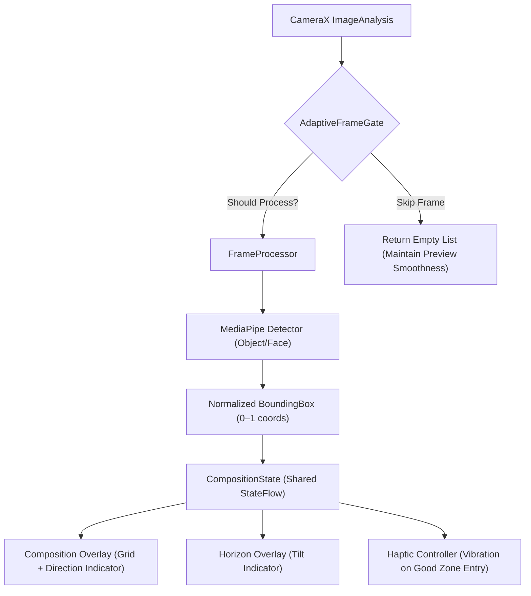

# Frame Coach: AI Camera Composition Assistant

An Android application that provides real-time, on-device camera composition coaching using MediaPipe's ML models. The app analyzes the live camera feed and guides users to reposition their camera for better framing (rule of thirds, subject framing, horizon level) without ever uploading or modifying images.

## Key Features

- 📱 **Real-time Processing**: Analyzes camera feed at 15+ FPS on mid-range devices
- 🎯 **Composition Guidance**: Rule of thirds and golden ratio overlays with directional indicators
- ⚡ **Adaptive Performance**: Dynamically adjusts frame processing rate to maintain preview smoothness
- 📏 **Horizon Leveling**: Uses device accelerometer to display tilt guidance
- 💫 **Haptic Feedback**: Subtle vibration when entering optimal composition zone
- 🔒 **100% Offline**: Zero network calls - all processing happens on-device
- 📸 **Photo Capture**: Save full-resolution images to device gallery
- ⚙️ **Customizable Settings**: Toggle grid, haptics, composition style, and camera mode
- 🧪 **Comprehensive Testing**: Unit tests for all pure logic components (rules engine, frame gate, horizon calculator)

## Tech Stack

- **Language**: Kotlin 1.9+
- **Framework**: Android SDK (Min SDK 24, Target SDK 35)
- **UI**: Jetpack Compose (Material 3)
- **Camera**: CameraX (Preview, ImageAnalysis, ImageCapture use cases)
- **ML Models**: 
  - Object Detection: MediaPipe EfficientDet-Lite0 (INT8 quantized)
  - Face Detection: MediaPipe BlazeFace (INT8 quantized)
- **Sensors**: Android SensorManager (accelerometer for horizon leveling)
- **Architecture**: 
  - Pure Kotlin rules engine (zero Android dependencies)
  - Unidirectional data flow (StateFlow for UI state)
  - Coroutines for background processing
- **Build**: Gradle Kotlin DSL
- **Testing**: JUnit 4 + Truth assertions
- **Design System**: Catppuccin Mocha color palette

## Prerequisites

- **Android Studio** Flamingo (2022.2.1) or later
- **Java Development Kit (JDK)** 11 or 17
- **Android SDK** 24.0.0 (Android 7.0 Nougat) or higher
- **Android Emulator** or physical device (API 24+)
- **Git** (for version control)
- Minimum 8GB RAM recommended for smooth emulator experience

## Getting Started

### 1. Clone the Repository

```bash
git clone https://github.com/Sumeet-basfore/FrameCoach.git
cd FrameCoach
```

### 2. Verify Java Installation

Ensure you have JDK 11 or 17 installed and configured:

```bash
java -version
# Should show openjdk version "11.0.x" or "17.0.x"
```

If not installed, use your package manager:
- macOS (with Homebrew): `brew install openjdk@11`
- Ubuntu: `sudo apt install openjdk-11-jdk`
- Windows: Download from [Adoptium](https://adoptium.net/)

### 3. Configure Android Studio

1. Open Android Studio
2. Select "Open an Existing Project"
3. Navigate to the `FrameCoach` directory and select `build.gradle.kts`
4. Wait for Gradle sync to complete (may take 5-10 minutes on first run)
5. When prompted, install any missing SDK platforms (API 24 and 35)

### 4. Verify Device Setup

#### For Physical Device:
1. Enable Developer Options:
   - Go to Settings → About phone → Tap "Build number" 7 times
2. Enable USB Debugging:
   - Settings → System → Developer options → USB debugging
3. Connect device via USB
4. Verify connection:
   ```bash
   adb devices
   # Should show your device ID
   ```

#### For Emulator:
1. In Android Studio, go to Tools → Device Manager
2. Create a new virtual device (Pixel 4 API 33 recommended)
3. Ensure "Play Store" is disabled (for better performance with camera)
4. Start the emulator

### 5. Build and Run the Application

#### Using Android Studio:
1. Click the "Run" button (green triangle) in the toolbar
2. Select your target device/emulator
3. Wait for build and installation to complete

#### Using Command Line:
```bash
# Assemble debug APK
./gradlew assembleDebug

# Install on connected device/emulator
./gradlew installDebug

# Or combine both:
./gradlew installDebug
```

### 6. Initial Launch Permissions

On first launch, the app will request:
- **CAMERA permission**: Required to access the camera feed
- **VIBRATE permission**: Required for haptic feedback (normal permission, no runtime prompt)

Grant these permissions when prompted. If denied initially:
- Go to Settings → Apps → Frame Coach → Permissions
- Enable Camera and Vibration permissions

## Project Structure

```
FrameCoach/
├── app/
│   ├── src/
│   │   ├── main/
│   │   │   ├── java/com/framecoach/app/          # Application source code
│   │   │   │   ├── FrameApplication.kt           # Application class
│   │   │   │   ├── MainActivity.kt               # Entry point with state-based navigation
│   │   │   │   │
│   │   │   │   ├── camera/                       # CameraX setup and permission handling
│   │   │   │   │   ├── CameraPreview.kt          # PreviewView + ImageAnalysis binding
│   │   │   │   │   ├── CameraScreen.kt           # Top-level screen with shutter button
│   │   │   │   │   ├── CameraPermissionState.kt  # Permission state enum
│   │   │   │   │   └── PermissionDeniedScreen.kt # Permission explanation screen
│   │   │   │   │
│   │   │   │   ├── detection/                    # MediaPipe detection pipeline
│   │   │   │   │   ├── BoundingBox.kt            # Normalized bounding box data class
│   │   │   │   │   ├── ObjectDetectorHelper.kt   # EfficientDet-Lite0 wrapper
│   │   │   │   │   ├── FaceDetectorHelper.kt     # BlazeFace wrapper
│   │   │   │   │   ├── FrameProcessor.kt         # Coroutine-based frame processor
│   │   │   │   │   └── AdaptiveFrameGate.kt      # Adaptive frame-skip + thermal throttling
│   │   │   │   │
│   │   │   │   ├── rules/                        # Pure logic composition engine
│   │   │   │   │   ├── CompositionRules.kt       # Rule-of-thirds/golden ratio algorithms
│   │   │   │   │   └── CompositionSuggestion.kt  # Directional suggestion + good zone flag
│   │   │   │   │
│   │   │   │   ├── ui/                           # Jetpack Compose UI components
│   │   │   │   │   ├── overlay/                  # Canvas-based overlays
│   │   │   │   │   │   ├── CompositionOverlay.kt # 3x3 grid + directional indicator
│   │   │   │   │   │   ├── HorizonOverlay.kt     # Spirit-level horizon indicator
│   │   │   │   │   │   ├── CompositionState.kt   # Shared StateFlow (detection → UI)
│   │   │   │   │   │   ├── HapticController.kt   # Vibrator on good-zone entry
│   │   │   │   │   │   └── GoodZoneEdgeDetector.kt # Rising-edge detection for haptics
│   │   │   │   │   │
│   │   │   │   │   ├── settings/                 # User preferences UI
│   │   │   │   │   │   ├── AppPreferences.kt     # SharedPreferences as StateFlows
│   │   │   │   │   │   └── SettingsScreen.kt     # Toggle grid, haptics, style, mode
│   │   │   │   │   │
│   │   │   │   │   └── theme/                    # Design system
│   │   │   │   │       ├── Color.kt              # Catppuccin Mocha palette
│   │   │   │   │       └── Theme.kt              # Material 3 dark color scheme
│   │   │   │   │
│   │   │   │   └── sensors/                      # Device sensor handling
│   │   │   │       ├── HorizonSensor.kt          # Accelerometer listener + low-pass filter
│   │   │   │       └── HorizonLevelCalculator.kt # Pure logic: threshold, normalised tilt
│   │   │   │
│   │   │   └── res/                              # Android resources
│   │   │       ├── layout/                       # XML layouts (minimal - mostly Compose)
│   │   │   │   ├── values/                       # Strings, colors, themes
│   │   │   │   ├── drawable/                     # Vector icons
│   │   │   │   ├── mipmap/                       # App launcher icons
│   │   │   │   └── anim/                         # Animation resources
│   │   │
│   │   └── AndroidManifest.xml                   # App configuration and permissions
│   │
│   └── test/                                     # Unit tests (JVM, no device needed)
│       └── java/com/framecoach/app/
│           ├── detection/
│   │   │       ├── AdaptiveFrameGateTest.kt      # Frame rate throttling tests
│   │   │       └── HorizonLevelCalculatorTest.kt # Horizon calculation tests
│   │   │
│   │   └── rules/
│   │       ├── CompositionRulesTest.kt           # Composition logic tests (ported from Python prototype)
│   │       └── GoodZoneEdgeDetectorTest.kt       # Haptic edge detection tests
│   │
│   └── java/com/framecoach/app/                  # Android instrumented tests (require device/emulator)
│       └── ...                                   # (Not implemented in v1 - pure logic tested via JVM tests)
│
├── build.gradle.kts                            # Project-level Gradle configuration
├── settings.gradle.kts                         # Module declarations
├── gradle.properties                           # Gradle JVM properties
├── gradlew                                     # Gradle wrapper (Unix)
├── gradlew.bat                                 # Gradle wrapper (Windows)
└── local.properties                            # SDK location (auto-generated, not in version control)
```

## Architecture Overview

### Core Principles

1. **Offline-First**: Zero network dependencies - all processing occurs on-device
2. **Privacy by Design**: No image uploads, storage, or sharing - pure coaching only
3. **Performance Conscious**: Adaptive frame processing maintains preview smoothness
4. **Modularity**: Clean separation between detection, logic, UI, and sensor layers
5. **Testability**: Pure Kotlin logic in `rules/` and `sensors/` packages is fully unit-testable on JVM

### Data Flow



### Key Components

#### Camera Pipeline (`camera/`)
- **CameraPreview.kt**: Binds Preview (viewfinder), ImageAnalysis (detection), and ImageCapture (photo capture) use cases to lifecycle
- **Handles**: Permission flow, shutter button, mode switching, settings navigation

#### Detection Pipeline (`detection/`)
- **ObjectDetectorHelper.kt**: Wraps MediaPipe's EfficientDet-Lite0 (general object detection)
- **FaceDetectorHelper.kt**: Wraps MediaPipe's BlazeFace (face detection for portrait mode)
- **FrameProcessor.kt**: 
  - Uses coroutines on `Dispatchers.Default` for background processing
  - Integrates with `AdaptiveFrameGate` for dynamic frame skipping
  - Measures processing latency and feeds back to gate for adjustment
  - Always closes `ImageProxy` to prevent resource leaks
- **AdaptiveFrameGate.kt**:
  - Implements exponential moving average (EMA) of processing latency
  - Dynamically adjusts skip interval (1-8 frames) based on:
    - `SLOW_THRESHOLD_MS` (80ms): Increase skip when processing too slow
    - `FAST_THRESHOLD_MS` (40ms): Decrease skip when processing fast
    - Thermal status from `PowerManager` (API 29+): Forces max skip during overheating
  - Includes anti-oscillation guards to prevent direction-flip jitter

#### Logic Engine (`rules/`)
- **Pure Kotlin**: Zero Android framework dependencies - fully unit-testable on JVM
- **CompositionRules.kt**:
  - Implements rule-of-thirds and golden ratio composition analysis
  - Three-peak fill-ratio system (10%, 56%, 82% ideal subject sizes)
  - Returns `CompositionSuggestion` with direction and `isGood` flag
  - Includes anti-oscillation logic requiring >5% improvement to change direction
- **CompositionSuggestion.kt**: 
  - Data class carrying directional suggestion, confidence status, and offset metrics
  - Companion object provides factory methods and predefined "GOOD" state

#### Sensor Handling (`sensors/`)
- **HorizonSensor.kt**:
  - Registers `TYPE_ACCELEROMETER` listener
  - Applies low-pass filter (α=0.8) to isolate gravity from linear acceleration
  - Calculates roll angle using `atan2(x, sqrt(y²+z²))`
  - Exposes roll angle via `StateFlow<Float>`
- **HorizonLevelCalculator.kt**:
  - Pure function converting roll angle to `HorizonLevelState`
  - Uses hysteresis-free threshold (±2° by default) for clean on/off detection
  - Normalizes tilt to [-1, 1] range clamped at ±45° for UI positioning

#### UI Layer (`ui/`)
- **Compose-First**: Entire UI built with Jetpack Compose
- **StateFlow Integration**: UI collects state from `CompositionState.suggestion` and `HorizonSensor.rollDeg`
- **Canvas Overlays**: 
  - `CompositionOverlay.kt`: Draws 3x3 grid (rule-of-thirds/golden ratio) and directional indicator
  - `HorizonOverlay.kt`: Draws spirit-level inspired tilt indicator (only visible when off-level)
- **Feedback Systems**:
  - `HapticController.kt`: Triggers vibration on rising edge of "good zone" state
  - `GoodZoneEdgeDetector.kt`: Ensures single vibration pulse per good-zone entry/exit cycle
- **Settings Persistence**:
  - `AppPreferences.kt`: Wraps `SharedPreferences` in `StateFlow` for reactive UI updates
  - Survives process death via Android's built-in SharedPreferences persistence

#### Testing Strategy (`test/`)
- **JVM Unit Tests**: All pure logic tested without Android framework
  - `RulesTest.kt`: Ported directly from Python prototype test suite
  - `AdaptiveFrameGateTest.cs`: Verifies frame-skipping logic and latency adaptation
  - `HorizonLevelCalculatorTest`: Checks threshold boundaries and normalization
  - `GoodZoneEdgeDetectorTest`: Validates rising-edge detection for haptics
- **No Instrumented Tests**: v1 focuses on testable core logic; UI/integration testing deferred to v2

## How It Works

### Composition Analysis
The core algorithm (in `CompositionRules.analyse()`) processes each detected object's bounding box:

1. **Size Check (Fill Ratio)**:
   - Calculates object area as percentage of frame
   - Compares against three ideal peaks: 10% (subject too small), 56% (ideal), 82% (subject too large)
   - Uses quadratic distance to nearest peak with tolerance (5% of frame)
   - Determines if subject needs to move closer/farther

2. **Position Check**:
   - Evaluates object center position relative to composition grid:
     - Rule of thirds: Vertical/horizontal lines at 33% and 66%
     - Golden ratio: Vertical/horizontal lines at 38% and 62%
   - Determines horizontal/vertical adjustment needed (left/right/up/down)
   - Applies anti-oscillation guard: Only changes direction if movement improves position by >5%

3. **Result Synthesis**:
   - Prioritizes size adjustment over position (subject too small/large takes precedence)
   - Returns directional suggestion with offset metrics for UI uses for animation intensity
   - Sets `isGood=true` only when both size and position are within tolerance

### Performance Optimization

#### Adaptive Frame Skipping
The `AdaptiveFrameGate` prevents detection from blocking the camera preview:

- **Baseline**: Process every frame (skip interval = 1)
- **Under Load**: 
  - Measures wall-clock time for each detection pass
  - Updates exponential moving average: `ema = α × current + (1-α) × previous`
  - When EMA > 80ms: Increase skip interval (process fewer frames)
  - When EMA < 40ms: Decrease skip interval (process more frames)
  - Clamped between 1 (every frame) and 8 (process 1/8 frames)
- **Thermal Throttling**:
  - Uses `PowerManager.addThermalStatusListener()` (API 29+)
  - Forces maximum skip (process 1/8 frames) during thermal throttling (level 3+)
  - Maintains minimum skip of 3 during mild thermal events (level 1-2)
- **Frame Processing**:
  - Runs on `Dispatchers.Default` coroutine dispatcher
  - Always closes `ImageProxy` in `finally` block to prevent resource leaks
  - Measures end-to-end latency including buffer release overhead

#### UI Performance
- **Compose Recomposition**: Minimal - only updates when `StateFlow` values change
- **Canvas Drawing**: 
  - Vector-based rendering (no bitmaps)
  - Optimized path calculations (precomputed ratios)
  - Conditional rendering (horizon overlay only draws when off-level)
- **State Updates**: 
  - Detection results posted via `StateFlow.value` (thread-safe)
  - UI collects state via `collectAsState()` (lifecycle-aware)

## Building for Release

### Generate Release APK
```bash
./gradlew assembleRelease
```
Output: `app/build/outputs/apk/release/app-release.apk`

### Generate Release AAB (Google Play Bundle)
```bash
./gradlew bundleRelease
```
Output: `app/build/outputs/bundle/release/app-release.aab`

### Signing the Release Build
1. Generate upload key (if not already available):
   ```bash
   keytool -genkeypair -v -keystore ~/upload-key.jks -keyalg RSA -keysize 2048 -validity 10000 -alias upload
   ```
2. Configure `gradle.properties` (add to `~/.gradle/gradle.properties` for security):
   ```properties
   MYAPP_UPLOAD_STORE_FILE=/path/to/upload-key.jks
   MYAPP_UPLOAD_STORE_PASSWORD=*****
   MYAPP_UPLOAD_KEY_ALIAS=upload
   MYAPP_UPLOAD_KEY_PASSWORD=*****
   ```
3. Build signed bundle:
   ```bash
   ./gradlew bundleRelease
   ```

### Installing Release Build on Device
```bash
# Install release APK
adb install -r app/build/outputs/apk/release/app-release.apk

# Or install via bundle (requires bundletool)
bundletool build-apks --bundle=app/build/outputs/bundle/release/app-release.aab \
  --output=app.apks \
  --mode=universal
adb install-multiple app.apks
```

## Testing

### Run Unit Tests (JVM - No Device Needed)
```bash
# Run all unit tests
./gradlew test

# Run specific test class
./gradlew test --tests "com.framecoach.app.rules.CompositionRulesTest"

# Run tests with test name pattern
./gradlew test --tests "*CompositionRules*"

# Generate test report (HTML)
./gradlew test jacocoTestReport
# Open: build/reports/tests/test/index.html
```

### Test Coverage
```bash
# Generate coverage report
./gradlew jacocoTestReport

# View in browser (requires python http.server or similar):
# cd build/reports/jacoco/test/html && python -m http.server 8080
# Then visit http://localhost:8080
```

### Running Specific Test Suites
```bash
# All detection tests
./gradlew test --tests "*DetectionTest*"

# All rules tests
./gradlew test --tests "*RulesTest*"

# All sensor tests
./gradlew test --tests "*SensorTest*"

# All UI-related tests (none in v1 - pure logic only)
./gradlew test --tests "*OverlayTest*"
```

## Troubleshooting

### Build Issues

**Error**: `Failed to install the following Android SDK packages: [platforms;android-34]`
**Solution**: 
1. Open SDK Manager in Android Studio
2. Install missing platform (API 34 in this example)
3. Or modify `build.gradle.kts` to use installed SDK version

**Error**: `Could not find com.google.android.gms:play-services-vision:20.1.3`
**Solution**: 
- This project uses MediaPipe Tasks Vision, not Play Services Vision
- Verify you're using the correct dependencies from `build.gradle.kts`
- Clean and rebuild: `./gradlew clean assembleDebug`

**Error**: `Execution failed for task ':app:compileDebugKotlin'. > Compilation error. See log for more details`
**Solution**:
1. Check Build tab for specific error
2. Common causes:
   - Missing Kotlin stdlib version compatibility
   - Incorrect import statements
   - Syntax errors in newly added code
3. Run `./gradlew clean` before rebuilding

### Runtime Issues

**App Crashes on Launch**:
1. Check Logcat in Android Studio for stack trace
2. Common causes:
   - Missing permissions in `AndroidManifest.xml`
   - Runtime permission not handled (CAMERA/VIBRATE)
   - MediaPipe model asset not found in `src/main/assets/models/`
   - Gradle dependency version conflict

**Camera Preview Shows Black Screen**:
1. Verify CAMERA permission is granted
2. Check if another app is using the camera
3. Try switching camera orientation (portrait/landscape locked in manifest)
   - Note: App is portrait-only per specification
4. Test on physical device (emulator camera support varies)

**No Detection Results**:
1. Verify model assets exist:
   - `app/src/main/assets/models/efficientdet_lite0.tflite`
   - `app/src/main/assets/models/face_detector.tflite`
2. Check Logcat for detection errors:
   - Look for `ObjectDetectorHelper` or `FaceDetectorHelper` tags
   - Common issues: Model format incompatibility, missing dependencies
3. Ensure adequate lighting and visible subject in frame
4. Try switching between General and Portrait mode

**Haptics Not Working**:
1. Verify VIBRATE permission is granted (normal permission, granted at install)
2. Test with device not in silent/vibrate mode
3. Some devices restrict haptics when battery is low
4. Check Logcat for `HapticController` tags

**Horizon Indicator Not Showing**:
1. Verify device has accelerometer (most phones do, some tablets/emulators don't)
2. Check Logcat for `HorizonSensor` warnings about missing sensor
3. Tilt device significantly (>5°) - indicator only shows when outside ±2° threshold
4. Try restarting sensor (leave and return to camera screen)

**Performance Issues (Janky Preview)**:
1. Check if device is overheating (triggers thermal throttling)
2. Close background apps consuming CPU
3. Test on physical device (emulator GPU acceleration varies)
4. Verify adaptive frame skipping is working:
   - Look for Logcat tags: `FrameProcessor`, `AdaptiveFrameGate`
   - Should see latency measurements and skip interval adjustments
5. Reduce background processes in Developer Options

### Camera-Specific Issues

**Error**: `Failed to create camera capture session`
**Solution**:
1. Another app may be holding camera open
2. Device may have camera hardware limitations
3. Try clearing camera app data: Settings → Apps → Camera → Storage → Clear Cache

**Error**: `ImageProxy format mismatch`
**Solution**:
1. Confirmed this project uses YUV_420_888 from CameraX
2. MediaPipe converters handle YUV to NV21 translation
3. Check `ObjectDetectorHelper.kt` and `FaceDetectorHelper.kt` for conversion logic
4. Ensure no custom CameraX output formats are being used

## Development Guidelines

### Code Style
- Follow [Kotlin Coding Conventions](https://kotlinlang.org/docs/coding-conventions.html)
- Use `val` over `var` unless reassignment is needed
- Prefer immutable data classes
- Keep functions focused and under 50 lines when possible
- Use meaningful names with clear intent
- Comment complex logic, not obvious code

### Android-Specific Practices
- **Context Handling**: 
  - Use `activityContext` for UI-related operations
  - Use `applicationContext` for long-lived objects
  - Avoid leaking Context in singletons
- **Threading**:
  - Never block main thread
  - Use `Dispatchers.Default` for CPU-intensive work (detection)
  - Use `Main.immediate` for UI updates
  - Consider `viewModelScope` for UI-scoped work
- **Resource Management**:
  - Always close `ImageProxy`, `MediaPipe` detectors, sensors
  - Use `try/finally` or `use{}` for deterministic cleanup
  - Register/unsubscribe lifecycle listeners in `onStart`/`onStop`
- **Permissions**:
  - Request at runtime for dangerous permissions (CAMERA)
  - Handle permanent denial gracefully
  - Explain why permission is needed in rationale

### Adding New Features
1. **Pure Logic** (Recommended for testability):
   - Add to `rules/` or `sensors/` packages
   - Write unit tests in corresponding `test/` package
   - Expose via clean Kotlin interfaces
2. **UI Components**:
   - Create in `ui/` package using Compose
   - Follow existing patterns for state handling (`StateFlow`)
   - Keep composables pure and side-effect-free where possible
3. **Detection Pipeline**:
   - Extend `DetectionHelper.kt` base pattern if adding new model types
   - Ensure thread safety with `Mutex`
   - Always handle model loading failures gracefully
4. **Settings**:
   - Add to `AppPreferences.kt` with corresponding `StateFlow`
   - Update `SettingsScreen.kt` with new toggle
   - Persist via `SharedPreferences.apply()`

## FAQ

### Q: Does this app store or transmit my images?
**A**: No. All image processing happens entirely in memory on your device. The app never writes images to storage (except when you explicitly tap the capture button), never sends data over the network, and has no internet permissions declared in the manifest.

### Q: Why does the app need VIBRATE permission?
**A**: The VIBRATE permission is required for the haptic feedback feature that provides a subtle pulse when your composition enters the "good zone." This is a normal permission that is granted at install time and does not require a runtime prompt.

### Q: Can I use this app on a tablet?
**A**: Yes, the app supports both phones and tablets. However:
- Some tablets may lack accelerometer hardware (required for horizon leveling)
- Tablet cameras often have lower quality than phone cameras
- The UI is optimized for phone portrait orientation but will scale to tablet screens
- Consider using a tablet stand for stable positioning

### Q: How accurate is the composition guidance?
**A**: The guidance is based on established photographic principles:
- Rule of thirds: Divides frame into 3x3 grid, subjects placed at intersections tend to be more engaging
- Golden ratio: More advanced composition technique based on mathematical proportions found in nature
- The app uses normalized coordinates (0-1 range) so it works identically across all screen sizes and resolutions
- Accuracy depends on:
  1. Quality of object/face detection (MediaPipe models are robust but not perfect)
  2. Lighting conditions (poor detection in low light)
  3. Subject contrast against background
  4. Device processing speed (affects frame rate via adaptive throttling)

### Q: Why does the frame rate sometimes drop?
**A**: The app implements adaptive frame throttling to maintain preview smoothness:
1. When processing takes too long (>80ms per frame), it skips more frames
2. When processing is fast (<40ms), it processes more frames
3. During device overheating, it maximizes frame skipping to reduce heat generation
4. You can observe this in Logcat via `FrameProcessor` and `AdaptiveFrameGate` tags
5. This is intentional behavior to prioritize a smooth viewfinder over maximum detection frequency

### Q: Can I use my own ML models?
**A**: Not in v1 without modification. The detection helpers are hardcoded to:
- `efficientdet_lite0.tflite` (object detection)
- `face_detector.tflite` (face detection)
To use custom models:
1. Replace the asset files in `src/main/assets/models/`
2. Update the `MODEL_PATH` constants in the helper classes
3. Adjust any model-specific parameters (input size, post-processing thresholds)
4. Note: Models must be in TensorFlow Lite format and compatible with MediaPipe's expected input/output signatures

### Q: How does the app handle different screen sizes and aspect ratios?
**A**: 
1. All detection coordinates are normalized to 0-1 range relative to frame dimensions
2. UI uses ConstraintLayout and flexible sizing where needed
3. Canvas overlays use proportional calculations based on actual canvas dimensions
4. The horizon indicator adjusts its line length based on the shorter screen dimension to stay within bounds
5. Tested on various aspect ratios (4:3, 16:9, 18:9, 20:9) through emulator configurations

### Q: Is this app suitable for professional photography?
**A**: The app is designed as a composition aid for casual and enthusiast photography:
- Provides real-time framing guidance based on established composition rules
- Helps develop intuition for subject placement and horizon leveling
- Does not replace artistic judgment or advanced techniques (leading lines, framing, depth, etc.)
- Best used as a learning tool to internalize composition principles
- For professional work, consider combining with traditional techniques and post-processing review

## License

This project is licensed under the MIT License - see the [LICENSE](LICENSE) file for details.

## Acknowledgments

- [MediaPipe](https://mediapipe.dev/) for the excellent cross-platform ML solutions
- [Jetpack Compose](https://developer.android.com/jetpack/compose) for modern Android UI toolkit
- [CameraX](https://developer.android.com/training/camerax) for simplified camera API
- [Catppuccin](https://catppuccin.com/) for the beautiful color palette
- The Android Open Source Project (AOSP) team

## Contact

For questions, feedback, or contributions, please open an issue on the GitHub repository.

--- 
*Last updated: 2026-07-19*  
*Built with ❤️ using Android Studio Flamingo and Kotlin 1.9*